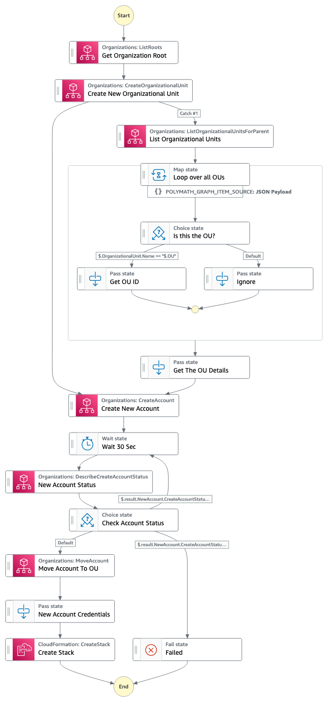

# Account Vending Machine 

This workflow creates a new AWS Account under an existing Organizational Unit. If the Organizational Unit does not exist, the workflow will create a new one under the root. If the account is created successfully it will deploy a CloudFormation template, that is provided as input, to the new account.

For more Step Functions workflows check [ServerlessLand Workflows](https://serverlessland.com/workflows)

Important: this application uses various AWS services and there are costs associated with these services after the Free Tier usage - please see the [AWS Pricing page](https://aws.amazon.com/pricing/) for details. You are responsible for any AWS costs incurred. No warranty is implied in this example.

## Requirements

* [Create an AWS account](https://portal.aws.amazon.com/gp/aws/developer/registration/index.html) if you do not already have one and log in. The IAM user that you use must have sufficient permissions to make necessary AWS service calls and manage AWS resources.
* [AWS CLI](https://docs.aws.amazon.com/cli/latest/userguide/install-cliv2.html) installed and configured
* [Git Installed](https://git-scm.com/book/en/v2/Getting-Started-Installing-Git)
* [AWS Serverless Application Model](https://docs.aws.amazon.com/serverless-application-model/latest/developerguide/serverless-sam-cli-install.html) (AWS SAM) installed

## Deployment Instructions

1. Create a new directory, navigate to that directory in a terminal and clone the GitHub repository:
    ``` 
    git clone https://github.com/aws-samples/step-functions-workflows-collection
    ```
1. Change directory to the pattern directory:
    ```
    cd account-vending-machine
    ```
1. From the command line, use AWS SAM to deploy the AWS resources for the workflow as specified in the template.yaml file:
    ```
    sam deploy --guided
    ```
1. During the prompts:
    * Enter a stack name
    * Enter the desired AWS Region
    * Allow SAM CLI to create IAM roles with the required permissions.

    Once you have run `sam deploy --guided` mode once and saved arguments to a configuration file (samconfig.toml), you can use `sam deploy` in future to use these defaults.

1. Note the outputs from the SAM deployment process. These contain the resource names and/or ARNs which are used for testing.

## How it works


1. Deploy this to your AWS Organizations management account, in order to automate the creation of new AWS accounts
2. Run the workflow to 
    - Check if you have an existing OU with the provided name or not. It will create a new one under the root if non existed
    - Create a new AWS account, and wait until it is successfully created
    - Move the new account under the provided OU
    - Create a new CloudFormation stack based on the CloudFormation template provided. This step will be done by assuming the default IAM role `OrganizationAccountAccessRole` that AWS Organizations automatically creates.


## Testing

1. Go to the AWS [Step Functions Console](https://console.aws.amazon.com/states/home) and find the State Machine from the Terraform Output. It should be named `AccountVendingStateMachine`
2. Select `Start Execution` and use a valid JSON data as input similar to the below.
3. The inputs required are
    - **OU** - Organization Unit Name
    - **AccountName** - The name of the new AWS account
    - **AccountEmail** - The new email address to use for the new AWS account
    - **TemplateBody** - AWS CloudFormation template in JSON format
4. Sample input:
  ```
    {
          "OU": "Production",
          "AccountName": "Aboushady Organization 2 Account",
          "AccountEmail": "aboushad+org1@amazon.com",
          "TemplateBody": {
                "AWSTemplateFormatVersion": "2010-09-09",
                "Description": "Template description",
                "Resources": {
                    <The Resources you will create goes here>
                }
          }
    }
  ```
5. Observe the State Machine workflow execution.

## Cleanup
 
1. Delete the stack
    ```bash
    aws cloudformation delete-stack --stack-name STACK_NAME
    ```
1. Confirm the stack has been deleted
    ```bash
    aws cloudformation list-stacks --query "StackSummaries[?contains(StackName,'STACK_NAME')].StackStatus"
    ```
----
Copyright 2023 Amazon.com, Inc. or its affiliates. All Rights Reserved.

SPDX-License-Identifier: MIT-0