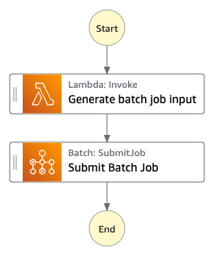

# AWS Batch with Lambda

This workflow demonstrates how to use Step Functions to pre-process data with AWS Lambda functions and then orchestrate AWS Batch jobs. Deploying this sample project will create an AWS Step Functions state machine, a Lambda function, and an AWS Batch job.

Important: this application uses various AWS services and there are costs associated with these services after the Free Tier usage - please see the [AWS Pricing page](https://aws.amazon.com/pricing/) for details. You are responsible for any AWS costs incurred. No warranty is implied in this example.

## Requirements

* [Create an AWS account](https://portal.aws.amazon.com/gp/aws/developer/registration/index.html) if you do not already have one and log in. The IAM user that you use must have sufficient permissions to make necessary AWS service calls and manage AWS resources.
* [AWS CLI](https://docs.aws.amazon.com/cli/latest/userguide/install-cliv2.html) installed and configured
* [Git Installed](https://git-scm.com/book/en/v2/Getting-Started-Installing-Git)
* [AWS Serverless Application Model](https://docs.aws.amazon.com/serverless-application-model/latest/developerguide/serverless-sam-cli-install.html) (AWS SAM) installed

## Deployment Instructions

1. Create a new directory, navigate to that directory in a terminal and clone the GitHub repository:
    ``` 
    git clone https://github.com/aws-samples/step-functions-workflows-collection
    ```
1. Change directory to the pattern directory:
    ```
    cd batch-lambda-sam
    ```
1. From the command line, use AWS SAM to deploy the AWS resources for the workflow as specified in the template.yaml file:
    ```
    sam deploy --guided
    ```
1. During the prompts:
    * Enter a stack name
    * Enter the desired AWS Region
    * Allow SAM CLI to create IAM roles with the required permissions.
    * Accept all other defaults

    Once you have run `sam deploy --guided` mode once and saved arguments to a configuration file (samconfig.toml), you can use `sam deploy` in future to use these defaults.

1. Note the outputs from the SAM deployment process. These contain the resource names and/or ARNs which are used for testing.

## How it works

The first step of this workflow uses a Lambda function to generate a random number and then passes this number to the next step.  Next, the Submit Batch Job step submits an AWS Batch job with the value passed from the previous step.  The AWS Batch job simply prints the supplied argument.

## Image



## Testing

Manually trigger the workflow via the Console or the AWS CLI.  The state machine ARN can be found as the ```StateMachineArn``` output in the stack's Outputs.

## Cleanup
 
1. Delete the stack
    ```bash
    sam delete
    ```
1. During the prompts:
```bash
    Are you sure you want to delete the stack batch-sample in the region us-east-1 ? [y/N]: y
    Are you sure you want to delete the folder batch-sample in S3 which contains the artifacts? [y/N]: y
```
----
Copyright 2022 Amazon.com, Inc. or its affiliates. All Rights Reserved.

SPDX-License-Identifier: MIT-0
