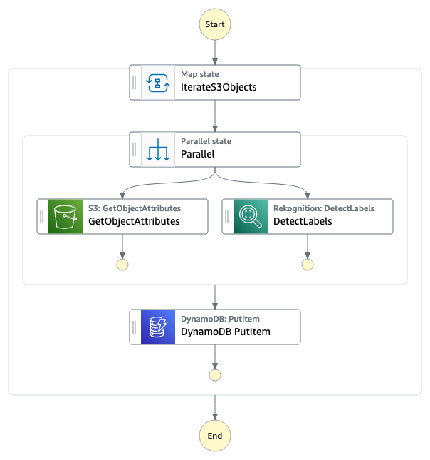
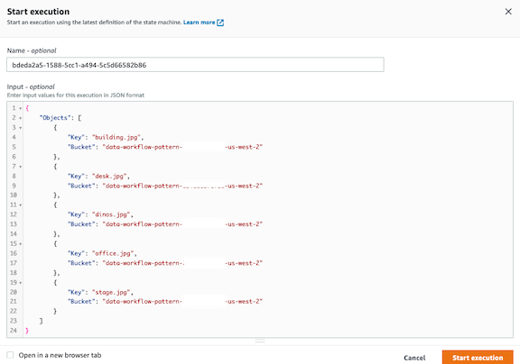

# Data Processing & Storage Pattern SAM

This application creates a DynamoDB table, S3 bucket and AWS Step Functions State Machine. The State Machine processes a list of images and retrieves objects metadata and image labels using machine learning in parallel, ultimately storing the result as one entry in the DynamoDB table. This pattern demonstrates how step functions can work with multiple data stores, manipulate, merge and store data for later processing.

For more Step Functions workflows check [ServerlessLand Workflows](https://serverlessland.com/workflows)

**Important:** this application uses various AWS services and there are costs associated with these services after the Free Tier usage - please see the [AWS Pricing page](https://aws.amazon.com/pricing/) for details. You are responsible for any AWS costs incurred. No warranty is implied in this example.

## Requirements

* [Create an AWS account](https://portal.aws.amazon.com/gp/aws/developer/registration/index.html) if you do not already have one and log in. The IAM user that you use must have sufficient permissions to make necessary AWS service calls and manage AWS resources.
* [AWS CLI](https://docs.aws.amazon.com/cli/latest/userguide/install-cliv2.html) installed and configured
* [Git Installed](https://git-scm.com/book/en/v2/Getting-Started-Installing-Git)
* [Terraform](https://learn.hashicorp.com/tutorials/terraform/install-cli?in=terraform/aws-get-started) installed

## How it works



1. Iterates over a list of objects in S3 provided as input using the [Map state](https://docs.aws.amazon.com/step-functions/latest/dg/amazon-states-language-map-state.html)
2. Retrieves object metadata and uses [Amazon Rekognition](https://docs.aws.amazon.com/rekognition/latest/dg/what-is.html) to obtain image labels in parallel using the [Parallel state](https://docs.aws.amazon.com/step-functions/latest/dg/amazon-states-language-parallel-state.html)
3. Data from previous parallel states is merged and stored as one DynamoDB entry

**Note:** Variables can be supplied in different options, check the [Terraform documentation](https://developer.hashicorp.com/terraform/language/values/variables) for more details.

## Deployment Instructions

1. Create a new directory, navigate to that directory in a terminal and clone the GitHub repository:
    ``` 
    git clone https://github.com/aws-samples/step-functions-workflows-collection
    ```
1. Change directory to the pattern directory:
    ```
    cd step-functions-workflows-collection/data-processing-tf
    ```
1. From the command line, initialize Terraform to download and install the providers defined in the configuration:
    ```
    terraform init
    ```
1. From the command line, apply the configuration in the main.tf file:
    ```
    terraform apply
    ```
1. During the prompts:
    * Enter yes
1. Make note of the output to identify the resources created, which will be used later in testing.
1. From the command line, run the following command to get the JSON input you will use with the AWS Step Functions State Machine.
    ```
    terraform output -raw StepFunctionInput 
    ```

## Testing

1. Go to the AWS [Step Functions Console](https://us-east-1.console.aws.amazon.com/states/home) and find the State Machine from the Terraform Output.
2. Select 'Start Execution' and copy the contents of the output command you ran earlier. Replace the existing comment in the input text area with it, then Start Execution.  *If you uploaded your own custom images, you will need to modify the input accordingly*


3. Observe the State Machine workflow execution. It may take several seconds for the workflow to complete
4. Navigate to DynamoDB in the AWS console, select Tables, then select the table created as displayed in the output. Click "Explore table items" and then perform a scan by clicking the Run button.  You should have several records with metadata and labels from the Rekognition service
5. Navigate back to your state machine execution within the AWS console. View the input and output of each state to see what data is passed and/or altered from one state to the next  
6. Select Edit state machine button, then the Workflow Studio button to view the state machine graphically. Click on each state to understand the configuration, input and output processing. View further documentation on [input and output processing](https://docs.aws.amazon.com/step-functions/latest/dg/concepts-input-output-filtering.html).  
 

## Cleanup
1. Change directory to the pattern directory:
    ```
    cd step-functions-workflows-collection/data-processing-tf
    ```
1. Delete all created resources
    ```bash
    terraform destroy
    ```
1. During the prompts:
    * Enter yes
1. Confirm all created resources has been deleted
    ```bash
    terraform show
    ```

----
Copyright 2022 Amazon.com, Inc. or its affiliates. All Rights Reserved.

SPDX-License-Identifier: MIT-0
