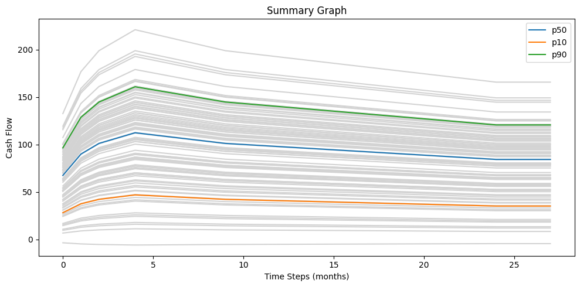

# Step function distributed map workflow for montecarlo simulation

This workflow is an example application of a step function distributed map implementing a montecarlo simulation. The state machine performs random sampling of input parameters to generate input samples in S3. The distributed map uses the input samples to run financial calculations in parallel. The resulting statistical results are stored in S3. 

For processing each input sample the Step Function will call a child state machine to run financial calculations.

Learn more about this workflow at Step Functions workflows collection: https://serverlessland.com/workflows/distributed-map-montecarlo-financial

Important: this application uses various AWS services and there are costs associated with these services after the Free Tier usage - please see the [AWS Pricing page](https://aws.amazon.com/pricing/) for details. You are responsible for any AWS costs incurred. No warranty is implied in this example.

## Requirements

- [Create an AWS account](https://portal.aws.amazon.com/gp/aws/developer/registration/index.html) if you do not already have one and log in. The IAM user that you use must have sufficient permissions to make necessary AWS service calls and manage AWS resources.
- [AWS CLI](https://docs.aws.amazon.com/cli/latest/userguide/install-cliv2.html) installed and configured
- [Git Installed](https://git-scm.com/book/en/v2/Getting-Started-Installing-Git)
- [AWS Serverless Application Model](https://docs.aws.amazon.com/serverless-application-model/latest/developerguide/serverless-sam-cli-install.html) (AWS SAM) installed

## Deployment Instructions

1. Create a new directory, navigate to that directory in a terminal and clone the GitHub repository:
   ```
   git clone https://github.com/aws-samples/step-functions-workflows-collection
   ```
1. Change directory to the workflow directory:
   ```
   cd distributed-map-montecarlo-financial
   ```
1. From the command line, use AWS SAM to deploy the AWS resources for the workflow as specified in the template.yaml file:
   ```
   sam deploy --guided
   ```
1. During the prompts:

   - Enter a stack name
   - Enter the desired AWS Region
   - Allow SAM CLI to create IAM roles with the required permissions.

   Once you have run `sam deploy --guided` mode once and saved arguments to a configuration file (samconfig.toml), you can use `sam deploy` in future to use these defaults.

1. Note the outputs from the SAM deployment process. These contain the resource names and/or ARNs which are used for testing.

## How it works

The state machine will take JSON input for mean, standard deviation and number of samples to generate samples for calculation. 
See below example input:

```
{
  "kwh_price_mean": 0.4,
  "kwh_price_standard_deviation": 0.2,
  "number_of_samples": 1000
}
```

From this example input the state machine will generate 1000 sample input CSV files in S3, which will be processed in the distributed map state by the child state machine.


The child state machine is from the type Express. It will run financial calculations and write the results to S3. 
The aggregate step will calculate statistical summary and render a graph.

## Testing

1. You need to upload a CSV file, called `solarfarm-data-yearly.csv` to the S3 bucket that was created when deploying this stack. 
This will provide the yearly electricity production and cost values for the solar farm we will calculate the financial indicator for. 
The file needs to have the following format:

```
date,capex_usd,opex_usd,production_kwh
2020-01-01T00:00:00Z,240000,8000,0
2021-01-01T00:00:00Z,140000,8000,0
2022-01-01T00:00:00Z,140000,8000,120000
2023-01-01T00:00:00Z,0,40000,440000
...
```

After that you can start an execution on the state machine. With the parameters for mean price, standard deviation and number of samples. 

You can then use the generated S3 presigned URLs for the summary results and the graph.



## Cleanup

1. Delete the stack
   ```bash
   aws cloudformation delete-stack --stack-name STACK_NAME
   ```
1. Confirm the stack has been deleted
   ```bash
   aws cloudformation list-stacks --query "StackSummaries[?contains(StackName,'STACK_NAME')].StackStatus"
   ```

---

Copyright 2022 Amazon.com, Inc. or its affiliates. All Rights Reserved.

SPDX-License-Identifier: MIT-0
