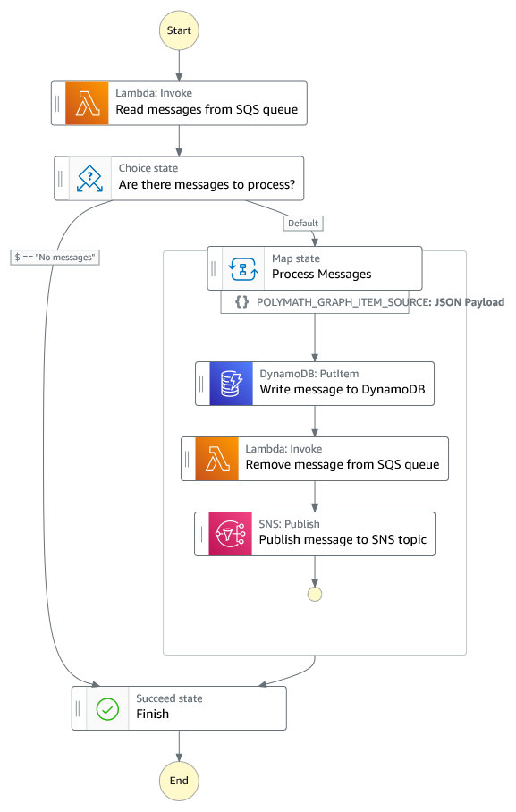

# Dynamically process data with a Map state

This workflow demonstrates dynamic parallelism using a Map state.
The sample project creates the following:
* Two AWS Lambda functions
* An Amazon Simple Queue Service (Amazon SQS) queue
* An Amazon Simple Notification Service (Amazon SNS) topic
* An Amazon DynamoDB table
* An AWS Step Functions state machine

Step function uses an AWS Lambda function to pull messages off an Amazon SQS queue, and passes a JSON array of those message to a Map state.
For each message in the queue, the state machine writes the message to DynamoDB, invokes the other Lambda function to remove the message from Amazon SQS, and then publishes the message to the Amazon SNS topic.

Learn more about this workflow at Step Functions workflows collection: << Add the live URL here >>

Important: this application uses various AWS services and there are costs associated with these services after the Free Tier usage - please see the [AWS Pricing page](https://aws.amazon.com/pricing/) for details. You are responsible for any AWS costs incurred. No warranty is implied in this example.

## Requirements

* [Create an AWS account](https://portal.aws.amazon.com/gp/aws/developer/registration/index.html) if you do not already have one and log in. The IAM user that you use must have sufficient permissions to make necessary AWS service calls and manage AWS resources.
* [AWS CLI](https://docs.aws.amazon.com/cli/latest/userguide/install-cliv2.html) installed and configured
* [Git Installed](https://git-scm.com/book/en/v2/Getting-Started-Installing-Git)
* [AWS CDK Installed](https://docs.aws.amazon.com/cdk/v2/guide/getting_started.html#getting_started_install)

## Deployment Instructions

1. If this is your first time using AWS CDK, bootstrap your [environment](https://docs.aws.amazon.com/cdk/v2/guide/getting_started.html#getting_started_bootstrap).
    ```
    cdk bootstrap aws://{your-aws-account-number}/{your-aws-region} 
    ```
2. Create a new directory, navigate to that directory in a terminal and clone the GitHub repository:
    ``` 
    git clone https://github.com/aws-samples/step-functions-workflows-collection
    ```
3. Change directory to the pattern directory:
    ```
    cd dynamically-process-data-with-map-state-cdk
    ```
4. From the command line, use npm to install dependencies and run the build process for the Lambda functions.:
    ```
    npm install
    npm run build
    ```
5. From the command line, use CDK to deploy the AWS resources for the workflow. Replace **InsertYourEmailAddressHere** with your own email address. This will create an email subscription to the SNS topic that will be built by this sample project. 
    ```
    cdk deploy --parameters UserEmailAddress=InsertYourEmailAddressHere
    ```
6. During the prompts:
    ```
    Do you wish to deploy these changes (y/n)? Y
    ```
7. Note the outputs from the cdk deployment process. These contain the resource names and/or ARNs which are used for testing.
## How it works

1. Messages are sent to an an SQS queue that resides in the AWS account.
2. When the state machine is executed, it will invoke a Lambda function that will call receiveMessage API to read the messages in the SQS queue, and then send the messages receieved to the next state. 
3. The state machine will check if there are any messages to process according to the output of the Lambda function. If there are no messages to process, the state machine will finish with a succeed state.
4. If there are messages to process, the state machine's map state will iterate over each message received to save it to dynamoDB, remove it from the SQS queue, and finally publish it to an SNS topic. SNS will send an email to the user containing the content of the message. Once all messages are proccessed, the state machine will finish with a succeed state. 

## Image


## Testing
1. After deployment you receive an email titled AWS Notification - Subscription Confirmation. Click on the link in the email to confirm your subscription. This will allow SNS to send you emails.
2. Add messages to the Amazon SQS queue.
* Navigate to the Amazon SQS console, and choose the queue that was created by the SAM template. The name will be similar to  **MapSampleProj-SQSQueue-1UDIC9VZDORN7**. 
* Select **Send and receieve messages** 
* On the **Send a Message** window, enter a message and choose **Send Message**. Continue entering messages until you have several in the Amazon SQS queue.
3. Start a new step functions execution 
* Navigate to the AWS Step Functions console and choose **MapStateStateMachine**, then choose **Start execution**
* On the New execution page, enter an execution name (optional), and then choose Start Execution.
* When an execution is complete, you can select states on the Visual workflow and browse the Input and Output under Step details.
4. You should be receiving emails that contain the content of the messages that you sent to the SQS queue. You can also check the DynamoDB table for the messages saved. 
* To check the DynamoDB table, navigate to the Amazon DynamoDB console and choose the table created by the SAM template. The name will be similar to **MapSampleProj-DDBTable-SADKY45DNPN6**.
* Choose **Explore table items**.
* Under **Items returned** you should see the messages that were sent to the SQS queue.


## Cleanup
 
1. Delete the stack
    ```bash
    cdk destroy
    ```
1. During the prompts:
    ```bash
        Are you sure you want to delete: MapStateCdkStack (y/n)? Y
    ```
----
Copyright 2023 Amazon.com, Inc. or its affiliates. All Rights Reserved.

SPDX-License-Identifier: MIT-0
