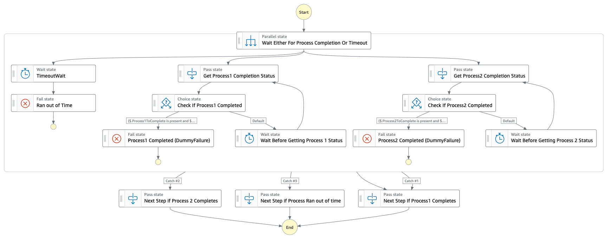

# Either Or Parallel Workflow

This workflow shows a pattern where there are multiple processes running in paralle, but the state machine can proceed as soon as one of the processes completes.

Learn more about this workflow at Step Functions workflows collection: << Add the live URL here >>

Important: this application uses various AWS services and there are costs associated with these services after the Free Tier usage - please see the [AWS Pricing page](https://aws.amazon.com/pricing/) for details. You are responsible for any AWS costs incurred. No warranty is implied in this example.

## Requirements

* [Create an AWS account](https://portal.aws.amazon.com/gp/aws/developer/registration/index.html) if you do not already have one and log in. The IAM user that you use must have sufficient permissions to make necessary AWS service calls and manage AWS resources.
* [AWS CLI](https://docs.aws.amazon.com/cli/latest/userguide/install-cliv2.html) installed and configured
* [Git Installed](https://git-scm.com/book/en/v2/Getting-Started-Installing-Git)
* [AWS Serverless Application Model](https://docs.aws.amazon.com/serverless-application-model/latest/developerguide/serverless-sam-cli-install.html) (AWS SAM) installed

## Deployment Instructions

1. Create a new directory, navigate to that directory in a terminal and clone the GitHub repository:
    ``` 
    git clone https://github.com/aws-samples/step-functions-workflows-collection
    ```
1. Change directory to the pattern directory:
    ```
    cd either-or-parallel-workflow
    ```
1. From the command line, use AWS SAM to deploy the AWS resources for the workflow as specified in the template.yaml file:
    ```
    sam deploy --guided
    ```
1. During the prompts:
    * Enter a stack name
    * Enter the desired AWS Region
    * Allow SAM CLI to create IAM roles with the required permissions.

    Once you have run `sam deploy --guided` mode once and saved arguments to a configuration file (samconfig.toml), you can use `sam deploy` in future to use these defaults.

1. Note the outputs from the SAM deployment process. These contain the resource names and/or ARNs which are used for testing.

## How it works

Explain how the workflow works.

## Image
Provide an exported .png of the workflow in the `/resources` directory from [Workflow stuio](https://docs.aws.amazon.com/step-functions/latest/dg/workflow-studio.html) and add here.


## Testing

1. After deployment navigate to the AWS Step Functions console and select the `EitherOrParallel` workflow. If you don't see it, make sure you are in the correct Region.
3. Select `Start Execution`, provide the input as `{ "Process1ToComplete" : true }` and then click `Start Execution`.
4. You will see that the task "Next Step If Process 1 Completes" gets executed.
3. Select `Start Execution` again, and this time provide the input as `{ "Process2ToComplete" : true }` and then click `Start Execution`.
4. You will see that the task "Next Step If Process 2 Completes" gets executed.
3. Select `Start Execution` again, and this time use the default json and then click `Start Execution`.
4. You will see that the task "Next Step If Process Ran out of time" gets executed.


## Cleanup
 
1. Delete the stack
    ```bash
    aws cloudformation delete-stack --stack-name STACK_NAME
    ```
1. Confirm the stack has been deleted
    ```bash
    aws cloudformation list-stacks --query "StackSummaries[?contains(StackName,'STACK_NAME')].StackStatus"
    ```
----
Copyright 2022 Amazon.com, Inc. or its affiliates. All Rights Reserved.

SPDX-License-Identifier: MIT-0
