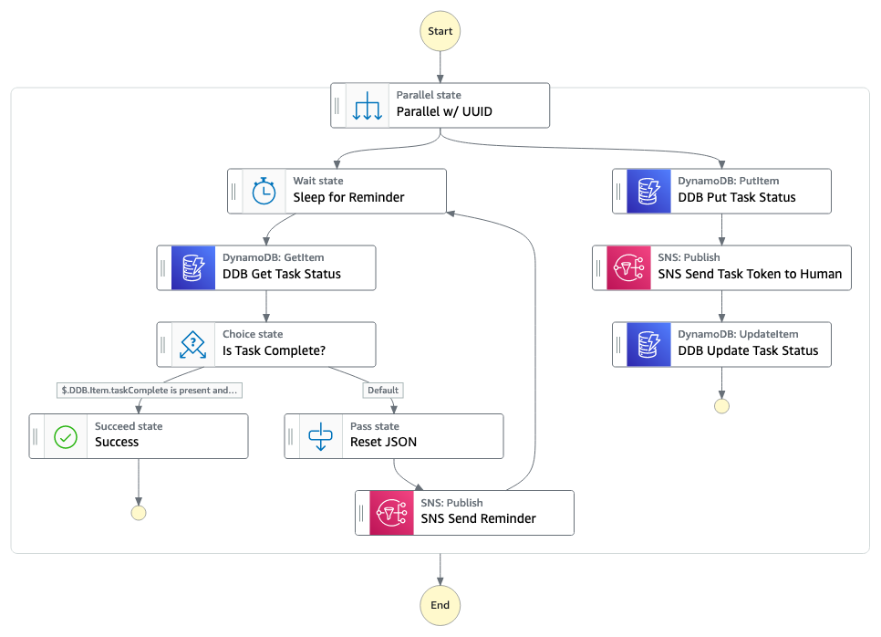

# Human Task w/ Reminder

This application will create a State Machine, an SNS topic, and a DynamoDB Table. The State Machine will create a UUID and save to DDB with Task Status as false. It will then send a Task Token to Human via SNS and wait for task to be completed.  At the same a loop will start that will Sleep for X seconds and then check Task Status in DDB.  It will send a Reminder and loop to begining until Task Status is true.

Important: this application uses various AWS services and there are costs associated with these services after the Free Tier usage - please see the [AWS Pricing page](https://aws.amazon.com/pricing/) for details. You are responsible for any AWS costs incurred. No warranty is implied in this example.

## Requirements

* [Create an AWS account](https://portal.aws.amazon.com/gp/aws/developer/registration/index.html) if you do not already have one and log in. The IAM user that you use must have sufficient permissions to make necessary AWS service calls and manage AWS resources.
* [AWS CLI](https://docs.aws.amazon.com/cli/latest/userguide/install-cliv2.html) installed and configured
* [Git Installed](https://git-scm.com/book/en/v2/Getting-Started-Installing-Git)
* [AWS Serverless Application Model](https://docs.aws.amazon.com/serverless-application-model/latest/developerguide/serverless-sam-cli-install.html) (AWS SAM) installed

## Deployment Instructions

1. Create a new directory, navigate to that directory in a terminal and clone the GitHub repository:
    ``` 
    git clone https://github.com/aws-samples/step-functions-workflows-collection
    ```
1. Change directory to the pattern directory:
    ```
    cd ./human-task-reminder
    ```
1. From the command line, use AWS SAM to deploy the AWS resources for the workflow as specified in the template.yaml file:
    ```
    sam deploy --guided
    ```
1. During the prompts:
    * Enter a stack name
    * Enter the desired AWS Region
    * Allow SAM CLI to create IAM roles with the required permissions.

    Once you have run `sam deploy --guided` mode once and saved arguments to a configuration file (samconfig.toml), you can use `sam deploy` in future to use these defaults.

1. Note the outputs from the SAM deployment process. These contain the resource names and/or ARNs which are used for testing.

## How it works

1. The State Machine starts by creating a Parallel flow and passing a UUID by using intrinsic function.
2. This UUID as key is put into DynamoDB with an attribute of `taskComplete:false` to use as reference.
3. An email message is sent to Human via SNS topic with a Task Token. The task will wait until Task Token is returned.
4. At the same time a loop will start that will Sleep for X seconds and then check the Task Status in DyanmoDB using UUID.  
5. DynamoDB response is passed to Choice state. If `taskComplete === true` the loop will end otherwise it will continue and send a Reminder email to Human via SNS and loop back to beginning. 
6. When the Task Token is returned to the State Machine it will move to the Update Task Status which will end the loop and complete the State Machine



## Testing

1. After deployment you will receive an email titled `AWS Notification - Subscription Confirmation`. Click on the link in the email to confirm your subscription. This will allow SNS to send you emails.
2. Navigate to the AWS Step Functions console and select the `HumanTaskReminder` workflow. If you don't see it, make sure you are in the correct Region.
3. Select `Start Execution`, use default input JSON and then click `Start Execution`.
4. Wait X seconds until you receive the Task email and the Reminder email.
5. Copy the Task Token from the Task email and use CLI to complete the Task by calling  `SendTaskSuccess` API.
    ```bash
        aws stepfunctions send-task-success --task-token <YOUR-TASK-TOKEN> --task-output '{"result":true}'
    ```
5. Observe the workflow complete the reminder loop by ending on Succeed State.

## Cleanup
 
1. Delete the stack
    ```bash
    sam delete
    ```
1. Confirm the stack has been deleted
    ```bash
    aws cloudformation list-stacks --query "StackSummaries[?contains(StackName,'STACK_NAME')].StackStatus"
    ```
----
Copyright 2022 Amazon.com, Inc. or its affiliates. All Rights Reserved.

SPDX-License-Identifier: MIT-0
