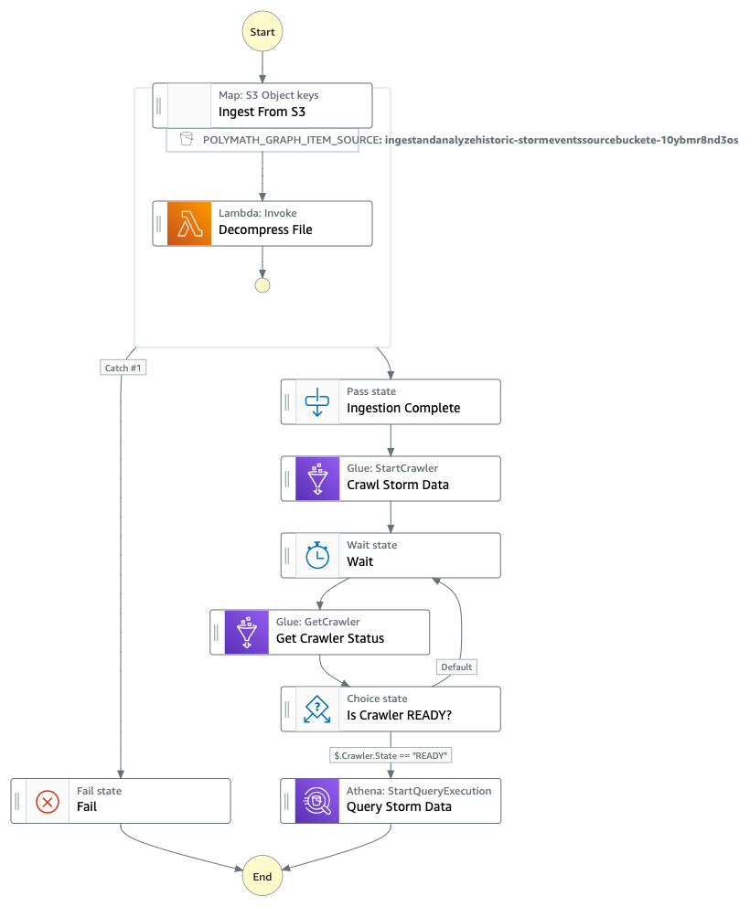
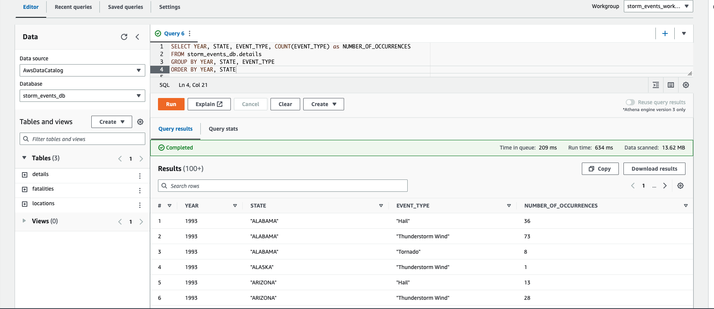

# Distributed Map - Ingest & Read Historical Storm Data
Storm Data is an official publication of the National Oceanic and Atmospheric Administration (NOAA) which documents the occurrence of storms and other significant weather phenomena having sufficient intensity to cause loss of life, injuries, 
significant property damage, and/or disruption to commerce. The workflow uses the distributed map function of Step function to decompress the zipped files at scale and drop them into an S3 bucket with a certain hierarchy. 
Using AWS's purpose-built services for analytics, we can read & analyze the storm data at scale that have occurred historically in the US. 

The application queries the [storm dataset](https://www1.ncdc.noaa.gov/pub/data/swdi/stormevents/csvfiles/) to find the number of occurrences of various event types across the US.

## Requirements

- [AWS Cloud Development Kit (AWS CDK) v2](https://docs.aws.amazon.com/cdk/v2/guide/getting_started.html)
- Python > 3.10.6
- [AWS CLI](https://docs.aws.amazon.com/cli/latest/userguide/cli-chap-getting-started.html)
- Docker


## Deployment Instructions

This project is set up like a standard Python project.  The initialization
process also creates a virtualenv within this project, stored under the `.venv`
directory.  To create the virtualenv it assumes that there is a `python3`
(or `python` for Windows) executable in your path with access to the `venv`
package. If for any reason the automatic creation of the virtualenv fails,
you can create the virtualenv manually.

To manually create a virtualenv on MacOS and Linux:

```
$ python3 -m venv .venv
```

After the init process completes, and the virtualenv is created, you can use the following
step to activate your virtualenv.

```
$ source .venv/bin/activate
```

If you are a Windows platform, you would activate the virtualenv like this:

```
% .venv\Scripts\activate.bat
```

Once the virtualenv is activated, you can install the required dependencies.

```
$ pip install -r requirements.txt
```

At this point you can now synthesize the CloudFormation template for this code.

```
$ cdk synth
```

Deploy this stack to your default AWS account/region

```
$ cdk deploy
```

To add additional dependencies, for example other CDK libraries, just add
them to your `setup.py` file and rerun the `pip install -r requirements.txt`
command.

### Useful commands
 * `cdk ls`          list all stacks in the app
 * `cdk diff`        compare deployed stack with current state
 * `cdk docs`        open CDK documentation

### Important resources created by this stack

- AWS Step function
- AWS Glue Crawler
- AWS Athena workgroup 

## Pre-run instructions

- Upload the zip files to a folder in the S3 bucket created by the stack
    - The storm data files (zipped format) can be obtained from the [NOAA website](https://www1.ncdc.noaa.gov/pub/data/swdi/stormevents/csvfiles/) directly
    - For the purpose of the example, we have few sample files that we can use for the demo
        ```
        $ cd sample_files
        $ aws s3 cp . s3://{output_bucket_name}/raw_source/ --recursive
        ``` 

## How it works

1. The workflow starts by iterating over all files in the S3 bucket under `/raw_source` folder
2. For zipped file, lambda function decompresses the file and places it in the right category under the `/formatted` folder
3. A Glue crawler then kicks off to populate the AWS Glue Data Catalog with tables
4. Once the crawl process is complete (using `wait`), an Athena query gets kicked off to find the number of occurrences of various event types across the US.



## How to run the workflow

- Using the console navigate to the Step function created using the stack in the Step function console
- To run this workflow payload is irrelevant as the Step function directly iterates over the `raw_source/` folder in the S3 bucket created by the stack.
    - To kick off the step function, you can use the below payload
        ```
        {
            "key1" : "v1"
        }
        ```
- Once the execution is complete, output of the last state is a link to the Athena execution id that you can navigate to on the console.
<Screen shot here>

- You can [build/modify the SQL query in the code](https://github.com/revanthreddy/step-functions-workflows-collection/blob/main/ingest-and-analyze-historical-storm-events/ingest_and_analyze_historical_storm_events/ingestion.py#L17) and re-deploying the stack

- Output of the Athena query



## Cleanup Instructions

- 
    ```
    $ cdk destroy
    ```
  Note: The S3 bucket will not be deleted as there are files in the bucket


