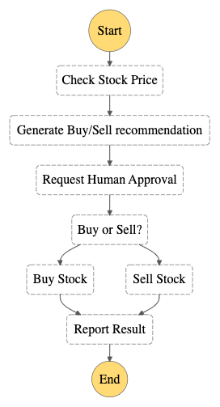

# Lambda Orchestration

This workflow demonstrates how to orchestrate Lambda Functions with Step Functions state machines. In this project, Step Functions uses a series of Lambda functions to check a stock price and determine a buy or sell trading recommendation. The recommendation is provided to the user and they  can choose whether to buy or sell the stock. The result of the trade is sent to a SNS topic.


Important: this application uses various AWS services and there are costs associated with these services after the Free Tier usage - please see the [AWS Pricing page](https://aws.amazon.com/pricing/) for details. You are responsible for any AWS costs incurred. No warranty is implied in this example.

## Requirements

* [Create an AWS account](https://portal.aws.amazon.com/gp/aws/developer/registration/index.html) if you do not already have one and log in. The IAM user that you use must have sufficient permissions to make necessary AWS service calls and manage AWS resources.
* [AWS CLI](https://docs.aws.amazon.com/cli/latest/userguide/install-cliv2.html) installed and configured
* [Git Installed](https://git-scm.com/book/en/v2/Getting-Started-Installing-Git)
* [AWS Serverless Application Model](https://docs.aws.amazon.com/serverless-application-model/latest/developerguide/serverless-sam-cli-install.html) (AWS SAM) installed

## Deployment Instructions

1. Create a new directory, navigate to that directory in a terminal and clone the GitHub repository:
    ``` 
    git clone https://github.com/aws-samples/step-functions-workflows-collection
    ```
1. Change directory to the pattern directory:
    ```
    cd lambda-orchestration-sam
    ```
1. From the command line, use AWS SAM to deploy the AWS resources for the workflow as specified in the template.yaml file:
    ```
    sam deploy --guided
    ```
1. During the prompts:
    * Enter a stack name
    * Enter the desired AWS Region
    * Allow SAM CLI to create IAM roles with the required permissions.

    Once you have run `sam deploy --guided` mode once and saved arguments to a configuration file (samconfig.toml), you can use `sam deploy` in future to use these defaults.

1. Note the outputs from the SAM deployment process. These contain the resource names and/or ARNs which are used for testing:

    * ```TopicName```: Name of the SNS topic where result is sent.
    * ```StateMachineName```: Name of Step Functions State Machine orchestrating the process.
    * ```StateMachineArn```:  ARN of the Step Functions State Machine orchestrating the process.

## How it works

This workflow simulates a stock trading process.  The first state simulates checking a stock price by generating a random number representing the price of a stock.  The stage passes this price to the Generate Buy/Sell recommendation state which determines if the trader should buy or sell the stock.  This recommendation is passed to an SQS queue simulating a trader verifying the recommendation and approving it.  This decision is passed to the Buy or Sell choice state which directs the flow to the proper buy or sell Lambda function.  The final stage reports the result to an SNS Topic.

## Image



## Testing

After deployment, add an email subscription to the SNS Topic found in the stack Output. Manually trigger the Step Function, either in the Console or using the CLI.  A successful execution will send an email notification to the subscription containing mock transaction data.

## Cleanup
 
1. Delete the stack
    ```bash
    sam delete
    ```

----
Copyright 2022 Amazon.com, Inc. or its affiliates. All Rights Reserved.

SPDX-License-Identifier: MIT-0
