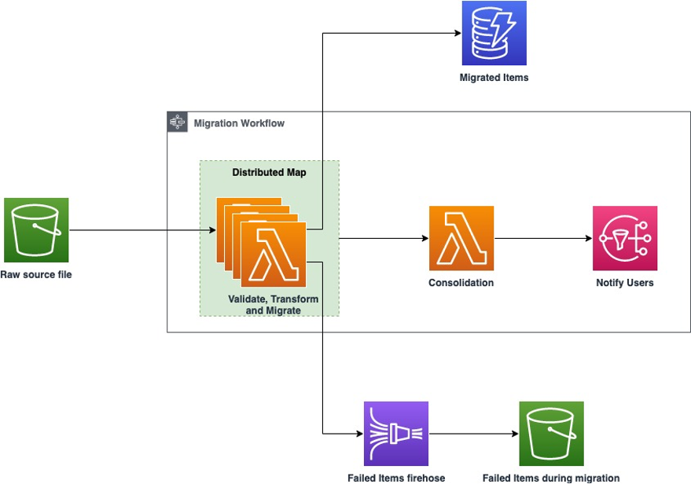
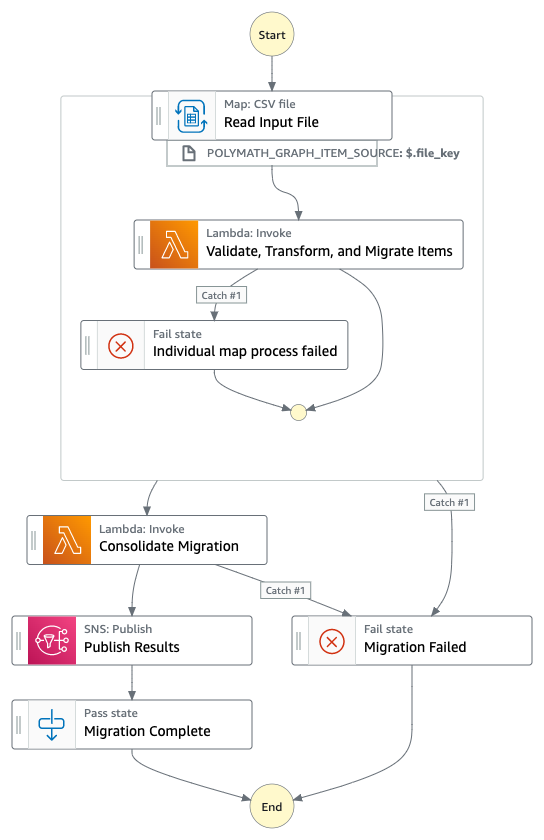

# Migrate large CSV data sets to Amazon DynamoDB at scale using AWS Step Functions Distributed Map feature
Most organizations use comma separated value (CSV) files to better organize large amounts of data sets, manipulate data, and import this data into another database for further processing. Customers are looking for ways to migrate, transform and store large amounts of data sets into serverless NoSQL databases that are fully managed, highly available and performant at scale. At times, the migration and transformation process can get non trivial and time consuming due to the complex set up of the resources along with the configurations involved to read and transform data. This gets even more challenging if the data set is large.

AWS customers use [Amazon DynamoDB](https://aws.amazon.com/dynamodb/), a serverless NoSQL database for applications that need low-latency data access. In this blog post, we show how to do large scale migrations and transformations of  [electric vehicle populations data](https://catalog.data.gov/dataset/electric-vehicle-population-data) to Amazon DynamoDB. The data set shows the Battery Electric Vehicles (BEVs) and Plug-in Hybrid Electric Vehicles (PHEVs) that are currently registered through Washington State Department of Licensing (DOL). We will use the Distributed Map feature of [AWS Step Functions](https://aws.amazon.com/step-functions/) which extends support for orchestrating large-scale parallel workloads thereby achieving high concurrency to ingest CSV files at scale, transform meta data and customer data, and store it is Amazon DynamoDB.


Transformation of the meta data and data includes:
- Add a prefix to a value
- Convert a value to lowercase
- Replace an empty space with an underscore (_)


## Prerequisites
For this walkthrough, you should have the following prerequisites: 
- An AWS account
- [AWS Cloud Development Kit (AWS CDK) v2](https://docs.aws.amazon.com/cdk/v2/guide/getting_started.html)
- Python > 3.10.6
- [AWS CLI](https://docs.aws.amazon.com/cli/latest/userguide/cli-chap-getting-started.html)
- Download Source data file from [DATA.GOV website](https://data.wa.gov/api/views/f6w7-q2d2/rows.csv?accessType=DOWNLOAD)


## Deployment Instructions

This project is set up like a standard Python project.  The initialization
process also creates a virtualenv within this project, stored under the `.venv`
directory.  To create the virtualenv it assumes that there is a `python3`
(or `python` for Windows) executable in your path with access to the `venv`
package. If for any reason the automatic creation of the virtualenv fails,
you can create the virtualenv manually.

To manually create a virtualenv on MacOS and Linux:

```
$ python3 -m venv .venv
```

After the init process completes and the virtualenv is created, you can use the following
step to activate your virtualenv.

```
$ source .venv/bin/activate
```

If you are a Windows platform, you would activate the virtualenv like this:

```
% .venv\Scripts\activate.bat
```

Once the virtualenv is activated, you can install the required dependencies.To add additional dependencies, for example other CDK libraries, just add
them to your `setup.py` file and rerun the `pip install -r requirements.txt`
command.
```
$ pip install -r requirements.txt
```

The first time you deploy an AWS CDK app into an environment (account/region), you’ll need to install a “bootstrap stack”. 
This stack includes resources that are needed for the toolkit’s operation.
```
$cdk bootstrap
```

AWS CDK apps are effectively only a definition of your infrastructure using code. 
When CDK apps are executed, they produce (or “synthesize”, in CDK parlance) an AWS CloudFormation template for each stack defined in your application. 
To synthesize a CDK app, use the cdk synth command.
```
$ cdk synth
```

Use the below command to deploy the CDK app
```
$ cdk deploy
```

### Key resources created by this stack (non-exhaustive)
- Amazon S3 bucket where we store the source CSV file
- AWS Step Function migration workflow
- Amazon DynamoDb table which is our destination table
- AWS Lambda functions to transform, validate,  and migrate
- Amazon Kinesis Data Firehose to redirect error records to save in S3 during the migration process
- Amazon SNS topic to publish results once the migration is complete

The application contains the minimum IAM resources required to run the workflow

*Note: If the application is created without running the migrations, you incur standard data costs present in the Amazon S3 bucket and the 
DynamoDb table created as part of this application.*

Below is the high level architecture diagram



Below is the AWS Step Function workflow



## How to run the migration workflow
- Download the [Source data file](https://data.wa.gov/api/views/f6w7-q2d2/rows.csv?accessType=DOWNLOAD) from DATA.GOV website and 
upload it to the s3 bucket created by the stack
- Run the Step Function by the following AWS CLI command to send the `start-execution` command to start the workflow. 
Note, you must edit the {STATE-MACHINE-ARN} and the {BUCKET-NAME} placeholder with the ARN of the deployed Step Functions workflow. This is provided in the stack outputs.
```bash
aws stepfunctions start-execution  --name "unique-execution-id" --state-machine-arn "{STATE-MACHINE-ARN}" --input "{  \"bucket_name\": \"{BUCKET-NAME}\", \"file_key\" : \"Electric_Vehicle_Population_Data.csv\"}"
```
### output:

```bash
{
    "executionArn": "arn:aws:states:us-east-1:123456789012:execution:MyStateMachine-LIXV3ls6HtnY:test",
    "startDate": 1620244153.977
}
```

Note the `executionArn` from the above output and run the below cli command to get the status of the execution

```bash
aws stepfunctions describe-execution --execution-arn  "{executionArn}"
```

### Get execution status output:

```bash
{
    "executionArn": "arn:aws:states:us-east-1:123456789012:execution:MyStateMachine-LIXV3ls6HtnY:test",
    "stateMachineArn": "arn:aws:states:us-east-1:123456789012:stateMachine:MyStateMachine-LIXV3lsV8tnY",
    "name": "60805db6-ca0a-44ee-b280-c6a44c5578a1",
    "status": "SUCCEEDED",
    "startDate": 1620244175.722,
    "stopDate": 1620244175.849,
    "input": "{  \"bucket_name\": \"{BUCKET-NAME}\", \"file_key\" : \"Electric_Vehicle_Population_Data.csv\"}",
    "inputDetails": {
        "included": true
    },
    "output": "{\"TOTAL_NUMBER_OF_ITEMS_WRITTEN\":197,\"TOTAL_NUMBER_OF_ITEMS_IN_ERROR\":3,\"DESTINATION_TABLE_NAME\":\"tb_ev_vehicle_data\",\"ERROR_DATA_LOCATION\":\"s3://{BUCKET-NAME}/migration_errors/execution_name=unique-execution-id\",\"SnsPublish\":{\"MessageId\":\"c2263c23-accc-5d7f-8385-60a948c3253d\",\"SdkHttpMetadata\":{\"AllHttpHeaders\":{\"x-amzn-RequestId\":[\"c49dc043-09be-5a05-b2bf-9cc9edb1f247\"],\"Content-Length\":[\"294\"],\"Date\":[\"Tue, 14 Mar 2023 21:06:23 GMT\"],\"Content-Type\":[\"text/xml\"]},\"HttpHeaders\":{\"Content-Length\":\"294\",\"Content-Type\":\"text/xml\",\"Date\":\"Tue, 14 Mar 2023 21:06:23 GMT\",\"x-amzn-RequestId\":\"c49dc043-09be-5a05-b2bf-9cc9edb1f247\"},\"HttpStatusCode\":200},\"SdkResponseMetadata\":{\"RequestId\":\"c49dc043-09be-5a05-b2bf-9cc9edb1f247\"}}}",
    "outputDetails": {
        "included": true
    }
}
```

Below is the output of the workflow

```bash
{
  "TOTAL_NUMBER_OF_ITEMS_WRITTEN": 197,
  "TOTAL_NUMBER_OF_ITEMS_IN_ERROR": 3,
  "DESTINATION_TABLE_NAME": "tb_ev_vehicle_data",
  "ERROR_DATA_LOCATION": "s3://{BUCKET-NAME}/migration_errors/execution_name=unique-execution-id",
  "SnsPublish": {
    "MessageId": "xxxx-xxx-xxxx",
    "SdkHttpMetadata": {
      "AllHttpHeaders": {
        "x-amzn-RequestId": [
          "c49dc043-09be-5a05-b2bf-9cc9edb1f247"
        ],
        "Content-Length": [
          "294"
        ],
        "Date": [
          "Tue, 14 Mar 2023 21:06:23 GMT"
        ],
        "Content-Type": [
          "text/xml"
        ]
      },
      "HttpHeaders": {
        "Content-Length": "294",
        "Content-Type": "text/xml",
        "Date": "Tue, 14 Mar 2023 21:06:23 GMT",
        "x-amzn-RequestId": "c49dc043-09be-5a05-b2bf-9cc9edb1f247"
      },
      "HttpStatusCode": 200
    },
    "SdkResponseMetadata": {
      "RequestId": "c49dc043-09be-5a05-b2bf-9cc9edb1f247"
    }
  }
}
```


## Cleanup
 
To avoid incurring future charges, delete the resources by running the following, delete the stack using the below command
```
$ cdk destroy
```
*Note: The S3 bucket and Amazon DynamoDB table will not be deleted as there are files in the bucket and data in the table. Delete them manually using AWS console or AWS CLI*