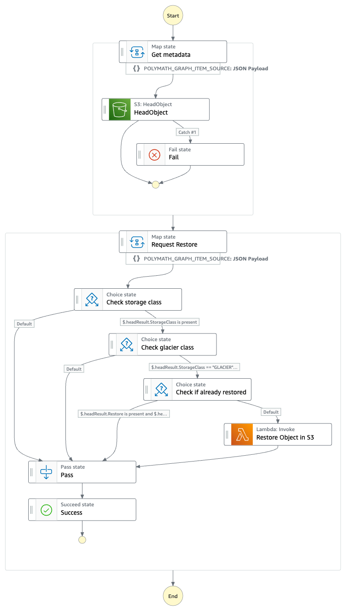

# Restore multiple files from S3 Glacier storage classes

This workflow demonstrates how to use Step Functions to orchestrate the restoration of multiple files that are archived in Amazon S3 Glacier Flexible Retrieval (Formerly S3 Glacier) and Amazon S3 Glacier Deep Archive. Files that are stored in these Glacier storage classes require minutes to hours of restoration time before they can be accessed. When multiple files need to be restored (in the same storage class, or a mix of storage classes), this workflow simplifies the retrieval process by providing a single output success event when all files are restored.

Learn more about this workflow at Step Functions workflows collection: https://github.com/deeppai/step-functions-workflows-collection/tree/main/s3-glacier-multi-file-restore

Important: this application uses various AWS services and there are costs associated with these services after the Free Tier usage - please see the [AWS Pricing page](https://aws.amazon.com/pricing/) for details. You are responsible for any AWS costs incurred. No warranty is implied in this example.

## Requirements

* [Create an AWS account](https://portal.aws.amazon.com/gp/aws/developer/registration/index.html) if you do not already have one and log in. The IAM user that you use must have sufficient permissions to make necessary AWS service calls and manage AWS resources.
* [AWS CLI](https://docs.aws.amazon.com/cli/latest/userguide/install-cliv2.html) installed and configured
* [Git Installed](https://git-scm.com/book/en/v2/Getting-Started-Installing-Git)
* [AWS Serverless Application Model](https://docs.aws.amazon.com/serverless-application-model/latest/developerguide/serverless-sam-cli-install.html) (AWS SAM) installed
* [Create an S3 Bucket](https://docs.aws.amazon.com/AmazonS3/latest/userguide/creating-bucket.html) and [upload files](https://docs.aws.amazon.com/AmazonS3/latest/userguide/uploading-an-object-bucket.html) in different storage classes.

## Deployment Instructions

1. Create a new directory, navigate to that directory in a terminal and clone the GitHub repository:
    ``` 
    git clone https://github.com/aws-samples/step-functions-workflows-collection
    ```
1. Change directory to the pattern directory:
    ```
    cd s3-glacier-multi-file-restore
    ```
1. From the command line, use AWS SAM to deploy the AWS resources for the workflow as specified in the template.yaml file:
    ```
    sam deploy --guided
    ```
1. During the prompts:
    * Enter a stack name
    * Enter the desired AWS Region
    * Allow SAM CLI to create IAM roles with the required permissions.

    Once you have run `sam deploy --guided` mode once and saved arguments to a configuration file (samconfig.toml), you can use `sam deploy` in future to use these defaults.

1. Note the outputs from the SAM deployment process. These contain the resource names and/or ARNs which are used for testing.

## How it works

The SAM template deploys the following state machine:



The first part of the state machine takes a list of S3 Bucket Names and Keys and gets their metadata using S3:HeadObject task. This metadata contains information about the object, such as the storage class that it is stored in and it's archival state, i.e. `archived`, `pending restore` or `restored`.

The second part of the state machine will then invoke the `Restore Object` AWS Lambda function to request restoration of the S3 object. The task will then pause the workflow and wait for the restoration to be complete.

When restoration is complete, Amazon S3 will emit an `Object Restore Completed` event to Amazon EventBridge which will trigger the `Restore Complete` AWS Lambda function to resume and complete the Step Function workflow. The two Lambda functions exchange the task tokens required to resume the Step Function workflow by storing it in an Amazon DynamoDB table.

At the end of the workflow all requested objects in S3 will be restored and ready for the client to access or download.

Note: The workflow has a timeout of two days since it can take up to 48 hours for restoration of objects from S3 Deep Archive storage class. Adjust this timeout if you are using other storage tiers.

## Testing

Before testing the workflow, ensure you have an S3 Bucket with objects uploaded. Also ensure you have [enabled S3 integration with Amazon EventBridge](https://docs.aws.amazon.com/AmazonS3/latest/userguide/enable-event-notifications-eventbridge.html).

Manually trigger the workflow via the Console or the AWS CLI. The state machine ARN can be found as the StateMachineArn output and the state machine name can be found as StateMachineName in the output.

To trigger the workflow in the console, navigate to Step Functions and then click the step function name from the list of State Machines. In the Executions panel, click Start Execution and enter the JSON input as shown below. Replace the placeholders with bucket names and object keys for the objects that you wish to restore.

```
{
  "objects": [
    {
      "bucket": "<bucket name>",
      "key": "<key name 1>"
    },
    {
      "bucket": "<bucket name>",
      "key": "<key name 2>"
    }
  ]
}
```

## Cleanup
 
1. Delete the stack
    ```bash
    sam delete
    ```
1. Confirm the stack has been deleted
    ```bash
    aws cloudformation list-stacks --query "StackSummaries[?contains(StackName,'STACK_NAME')].StackStatus"
    ```
----
Copyright 2023 Amazon.com, Inc. or its affiliates. All Rights Reserved.

SPDX-License-Identifier: MIT-0
