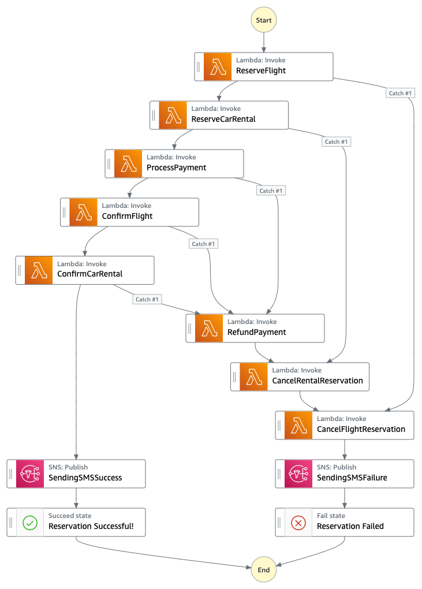

# Workflow title

This workflow uses AWS Step Functions to build a saga pattern to book flights, book car rentals, and process payments for a vacation.

Learn more about this workflow at Step Functions workflows collection: << Add the live URL here >>

Important: this application uses various AWS services and there are costs associated with these services after the Free Tier usage - please see the [AWS Pricing page](https://aws.amazon.com/pricing/) for details. You are responsible for any AWS costs incurred. No warranty is implied in this example.

## Requirements

* [Create an AWS account](https://portal.aws.amazon.com/gp/aws/developer/registration/index.html) if you do not already have one and log in. The IAM user that you use must have sufficient permissions to make necessary AWS service calls and manage AWS resources.
* [AWS CLI](https://docs.aws.amazon.com/cli/latest/userguide/install-cliv2.html) installed and configured
* [Git Installed](https://git-scm.com/book/en/v2/Getting-Started-Installing-Git)
* [AWS Serverless Application Model](https://docs.aws.amazon.com/serverless-application-model/latest/developerguide/serverless-sam-cli-install.html) (AWS SAM) installed

## Deployment Instructions

1. Create a new directory, navigate to that directory in a terminal and clone the GitHub repository:
    ``` 
    git clone https://github.com/aws-samples/step-functions-workflows-collection
    ```
1. Change directory to the pattern directory:
    ```
    cd saga-pattern-sam
    ```

1. If needed, update the variable ```region``` in ```variables.tf``` to the region of your choice.  The default is ```us-east-1```.

2. From the command line, use npm to install dependencies and run the build process for the Lambda functions.
    ```
    npm install
    npm run build
    ```

3. From the command line, use Terraform to deploy the AWS resources for the workflow as specified in the main.tf file:
    ```
    sam build
    sam deploy --guided
    ```

## How it works

The following workflow diagram illustrates the typical flow of the travel reservation system. The workflow consists of reserving air travel, reserving a car, processing payments, confirming flight reservations, and confirming car rentals followed by a success notification when these steps are complete. However, if the system encounters any errors in running any of these transactions, it starts to fail backward. For example, an error with payment processing triggers a refund, which then triggers a cancellation of the rental car and flight, which ends the entire transaction with a failure message.

## Image
Provide an exported .png of the workflow in the `/resources` directory from [Workflow stuio](https://docs.aws.amazon.com/step-functions/latest/dg/workflow-studio.html) and add here.


## Testing

For testing purposes, this pattern deploys API Gateway and a test Lambda function that triggers the Step Functions state machine. With Step Functions, you can control the functionality of the travel reservation system by passing a run_type parameter to mimic failures in “ReserveFlight,” “ReserveCarRental,” “ProcessPayment,” “ConfirmFlight,” and “ConfirmCarRental.”

The saga Lambda function (sagaLambda.ts) takes input from the query parameters in the API Gateway URL, creates the following JSON object, and passes it to Step Functions for execution:

    ```
    let input = {
        "trip_id": tripID, //  value taken from query parameter, default is AWS request ID
        "depart_city": "Detroit",
        "depart_time": "2021-07-07T06:00:00.000Z",
        "arrive_city": "Frankfurt",
        "arrive_time": "2021-07-09T08:00:00.000Z",
        "rental": "BMW",
        "rental_from": "2021-07-09T00:00:00.000Z",
        "rental_to": "2021-07-17T00:00:00.000Z",
        "run_type": runType // value taken from query parameter, default is "success"
    };
    ```

You can experiment with different flows of the Step Functions state machine by passing the following URL parameters:

Successful Execution ─ https://{api gateway url}

Reserve Flight Fail ─ https://{api gateway url}?runType=failFlightsReservation

Confirm Flight Fail ─ https://{api gateway url}?runType=failFlightsConfirmation

Reserve Car Rental Fail ─ https://{api gateway url}?runType=failCarRentalReservation

Confirm Car Rental Fail ─ https://{api gateway url}?runType=failCarRentalConfirmation

Process Payment Fail ─ https://{api gateway url}?runType=failPayment

Pass a Trip ID ─ https://{api gateway url}?tripID={by default, trip ID will be the AWS request ID}

## Cleanup

1. Delete the stack
    ```bash
    sam delete
    ```

----
Copyright 2022 Amazon.com, Inc. or its affiliates. All Rights Reserved.

SPDX-License-Identifier: MIT-0