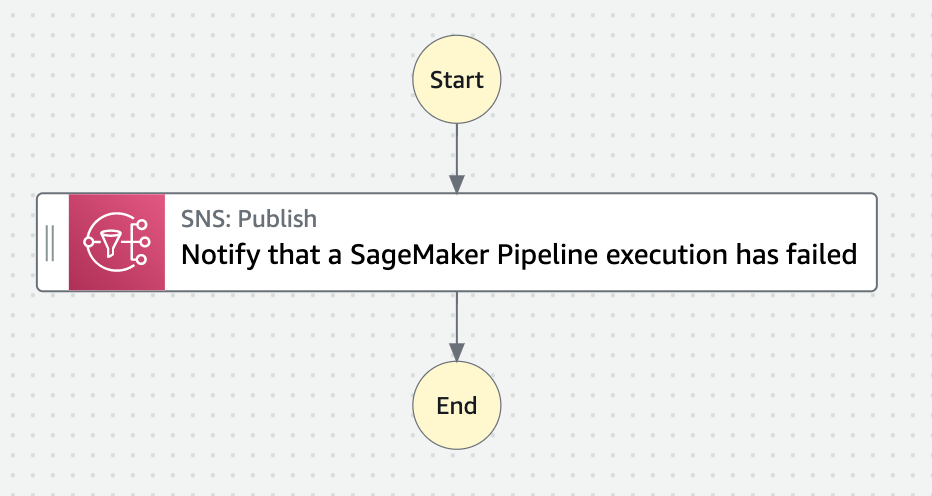

# SageMaker Pipeline Notifications

This workflow implements a notification system for when an [Amazon SageMaker Pipeline](https://aws.amazon.com/sagemaker/pipelines/) execution fails. For customers with many running pipelines, it becomes challenging to see which ones may have failed. This workflow provides an alert of a failed pipeline execution for further investigation as to why the pipeline failed. The system sends an email notification via [Amazon SNS](https://aws.amazon.com/sns/) but could easily be extended to trigger other automated remediation actions e.g. automated creation of a ticket in your ticketing system via [AWS Lambda](https://aws.amazon.com/lambda/). The workflow relies exclusively on [AWS SDK service integrations](https://docs.aws.amazon.com/step-functions/latest/dg/supported-services-awssdk.html) and contains no custom Lambda code that needs to be maintained.

Important: this application uses various AWS services and there are costs associated with these services after the Free Tier usage - please see the [AWS Pricing page](https://aws.amazon.com/pricing/) for details. You are responsible for any AWS costs incurred. No warranty is implied in this example.

## Requirements

* [Create an AWS account](https://portal.aws.amazon.com/gp/aws/developer/registration/index.html) if you do not already have one and log in. The IAM user that you use must have sufficient permissions to make necessary AWS service calls and manage AWS resources.
* [AWS CLI](https://docs.aws.amazon.com/cli/latest/userguide/install-cliv2.html) installed and configured
* [Git Installed](https://git-scm.com/book/en/v2/Getting-Started-Installing-Git)
* [AWS CDK Installed](https://docs.aws.amazon.com/cdk/v2/guide/getting_started.html#getting_started_install)

## Deployment Instructions

1. If this is your first time using AWS CDK, bootstrap your [environment](https://docs.aws.amazon.com/cdk/v2/guide/getting_started.html#getting_started_bootstrap).

    ```bash
    cdk bootstrap aws://{your-aws-account-number}/{your-aws-region}
    ```

1. Create a new directory, navigate to that directory in a terminal and clone the GitHub repository:

    ```bash
    git clone https://github.com/aws-samples/step-functions-workflows-collection
    ```

1. Change directory to the pattern directory:

    ```bash
    cd sagemaker-pipeline-notifications-cdk/python
    ```

1. Create a Python virtual environment and install the requirements:

    ```bash
    python3 -m venv .venv
    source .venv/bin/activate
    python3 -m pip install -r requirements.txt
    ```

1. At the bottom of the `app.py` file, replace the `notification_email` variable with your own email address.

1. From the command line, use CDK to deploy the AWS resources for the workflow as specified in the ```app.py``` file:

    ```bash
    cdk deploy
    ```

1. During the prompts:

    ```text
    Do you wish to deploy these changes (y/n)? Y
    ```

## How it works



1. When an [Amazon SageMaker Pipeline](https://aws.amazon.com/sagemaker/pipelines/) execution fails, it triggers an [Amazon EventBridge](https://aws.amazon.com/eventbridge/) rule which starts the [AWS Step Functions](https://aws.amazon.com/step-functions/) state machine.
1. The state machine extracts information about the pipeline from the event and sends an email notification via the [Amazon SNS](https://aws.amazon.com/sns/) topic.

## Testing

1. Deploy the State Machine via CDK using the instructions above, ensuring that you configure your `notification_email`.
1. You should receive an email requesting confirmation of your subscription to the Amazon SNS topic. Accept this.
1. Run a SageMaker pipeline which you expect to fail, you should receive an email notifying of the failure. If you do not have a SageMaker pipeline configured, you can navigate to the AWS Step Functions console and open this statemachine. From there, "Start execution" using the following event as the input valuee:

    ```json
    {
        "version": "0",
        "id": "a1b2c3d4-1234-5678-9abc-12345678abcd",
        "detail-type": "SageMaker Model Building Pipeline Execution Status Change",
        "source": "aws.sagemaker",
        "account": "111122223333",
        "time": "2023-03-15T08:36:42Z",
        "region": "us-east-1",
        "resources": [
            "arn:aws:sagemaker:us-east-1:111122223333:pipeline/abalone-pipeline",
            "arn:aws:sagemaker:us-east-1:111122223333:pipeline/abalone-pipeline/execution/a1b2c3d4e6f7"
        ],
        "detail": {
            "pipelineExecutionDisplayName": "test",
            "currentPipelineExecutionStatus": "Failed",
            "previousPipelineExecutionStatus": "Executing",
            "executionStartTime": "2023-03-15T08:36:39Z",
            "executionEndTime": "2023-03-15T08:36:42Z",
            "pipelineArn": "arn:aws:sagemaker:us-east-1:111122223333:pipeline/abalone-pipeline",
            "pipelineExecutionArn": "arn:aws:sagemaker:us-east-1:111122223333:pipeline/abalone-pipeline/execution/a1b2c3d4e6f7"
        }
    }
    ```

## Cleanup

To delete the resources created by this template:

1. Delete the stack

    ```bash
    cdk destroy
    ```

1. During the prompts:

    ```bash
        Are you sure you want to delete: SageMakerPipelineNotificationsPython (y/n)? Y
    ```

---

Copyright 2022 Amazon.com, Inc. or its affiliates. All Rights Reserved.

SPDX-License-Identifier: MIT-0
