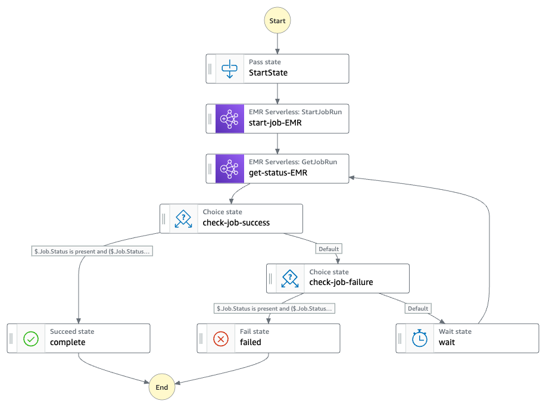

# Synchronous Run EMR Serverless jobs

This workflow is used to run big data jobs with Step functions coordinating an EMR Serverless application.

EMR Serverless, when configured with autoStart and autoStop, is only active when a job is submitted to the EMR application, allowing for a true serverless big data processing experience.

The step function submits a job to an EMR Serverless application and periodically checks for the job status before continuing to the next iteration (in a real-life scenario, the following step function steps might perform operations that are dependant from the EMR job conclusion such as manipulate the job Output files). 

This is done without using lambda and custom code, instead we rely on native integration between step function and AWS services using the "CallAwsService" functionality to reduce the amount of application code to maintain.


## Requirements

* [Create an AWS account](https://portal.aws.amazon.com/gp/aws/developer/registration/index.html) if you do not already have one and log in. The IAM user that you use must have sufficient permissions to make necessary AWS service calls and manage AWS resources.
* [AWS CLI](https://docs.aws.amazon.com/cli/latest/userguide/install-cliv2.html) installed and configured
* [Git Installed](https://git-scm.com/book/en/v2/Getting-Started-Installing-Git)
* [AWS Serverless Application Model](https://docs.aws.amazon.com/serverless-application-model/latest/developerguide/serverless-sam-cli-install.html) (AWS SAM) installed

## Deployment Instructions

1. Create a new directory, navigate to that directory in a terminal and clone the GitHub repository:
    ``` 
    git clone https://github.com/aws-samples/step-functions-workflows-collection
    ```
2. Change directory to the pattern directory:
    ```
    cd step-functions-emr-serverless-cdk/typescript
    ```
3. Install the nodejs dependencies
    ```
    npm install
    ```
3. From the command line, use AWS CDK to deploy the AWS resources for the workflow as specified in the cdk files:
    ```
    cdk deploy
    ```

## How it works

The step function send a job to EMR Serverless using the StartJobRun API. After doing so, it periodically call the GetJobRun API to check if the job is in complete/failed/cancelled status.
After retrieving the status, it completes the execution.
The EMR Serverless job, in this example is a simple Pyspark script that:

* Read a CSV dataset in the input_data S3 folder
* Perform some simple ETL operation
* Write an output parquet dataset in the output/ folder of the S3 bucket

## Image


## Testing

You can test the step function following these steps: 
* head to the AWS console
* run the step function in us-east-1
* look at the output directory in the bucket, containing the output parquet files

## Cleanup
 
1. Delete the stack
    ```bash
    cdk destroy
    ```
----
Copyright 2023 Amazon.com, Inc. or its affiliates. All Rights Reserved.

SPDX-License-Identifier: MIT-0