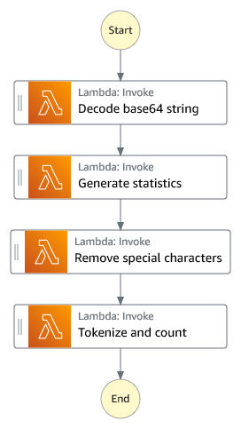

# Process High-Volume Messages from Amazon SQS

This sample project demonstrates how to use an AWS Step Functions Express Workflow to process messages or data from a high-volume event source, such as Amazon Simple Queue Service (Amazon SQS). Because Express Workflows can be started at a very high rate, they are ideal for high-volume event processing or streaming data workloads.

Here are two commonly used methods to execute your state machine from an event source:

* Configure an Amazon CloudWatch Events rule to start a state machine execution whenever the event source emits an event. For more information, see [Creating a CloudWatch Events Rule That Triggers on an Event](https://docs.aws.amazon.com/AmazonCloudWatch/latest/events/Create-CloudWatch-Events-Rule.html). 

* Map the event source to a Lambda function, and write function code to execute your state machine. The AWS Lambda function is invoked each time your event source emits an event, in turn starting a state machine execution. For more information see [Using AWS Lambda with Amazon SQS](https://docs.aws.amazon.com/lambda/latest/dg/with-sqs.html).

This sample project uses the second method to start an execution each time the Amazon SQS queue sends a message. The state machine, which consists of a chain of Lambda functions, will then process the text message by decoding it, generating statistics, removing special characters, tokenizing and counting the number of occurance of each word in the text passage.    

Learn more about this workflow at Step Functions workflows collection: << Add the live URL here >>

Important: this application uses various AWS services and there are costs associated with these services after the Free Tier usage - please see the [AWS Pricing page](https://aws.amazon.com/pricing/) for details. You are responsible for any AWS costs incurred. No warranty is implied in this example.

## Requirements

* [Create an AWS account](https://portal.aws.amazon.com/gp/aws/developer/registration/index.html) if you do not already have one and log in. The IAM user that you use must have sufficient permissions to make necessary AWS service calls and manage AWS resources.
* [AWS CLI](https://docs.aws.amazon.com/cli/latest/userguide/install-cliv2.html) installed and configured
* [Git Installed](https://git-scm.com/book/en/v2/Getting-Started-Installing-Git)
* [AWS CDK Installed](https://docs.aws.amazon.com/cdk/v2/guide/getting_started.html#getting_started_install)

## Deployment Instructions

1. If this is your first time using AWS CDK, bootstrap your [environment](https://docs.aws.amazon.com/cdk/v2/guide/getting_started.html#getting_started_bootstrap).
    ```
    cdk bootstrap aws://{your-aws-account-number}/{your-aws-region} 
    ```
1. Create a new directory, navigate to that directory in a terminal and clone the GitHub repository:
    ``` 
    git clone https://github.com/aws-samples/step-functions-workflows-collection
    ```
1. Change directory to the pattern directory:
    ```
    cd text-processing-sqs-express-cdk
    ```
1. From the command line, use npm to install dependencies and run the build process:
    ```
    npm install
    npm run build
    ```
1. From the command line, use CDK to deploy the AWS resources for the workflow.
    ```
    cdk deploy 
    ```
1. During the prompts:
    ```
    Do you wish to deploy these changes (y/n)? Y
    ```
1. Note the outputs from the cdk deployment process. These contain the resource names and/or ARNs which are used for testing.

## How it works
1. When messages are sent to the SQS queue, a lambda function that has event source mapping to the SQS queue will invoke the state machine.
1. The state machine will then invoke a lambda function that will decode the base64 string recieved from the SQS queue. The lambda function's output will be sent to the next state. 
1. The state machine will invoke a lambda function that will generate statistics based on the string input received. Statistics include text length, average word length, number of digits and number of special characters. The lambda function's output will be sent to the next state. 
1. The state machine will invoke a lambda function that will remove special characters from the string input received. The lambda function's output will be sent to the next state. 
1. Finally, the state machine will invoke a lambda function that will tokenize and count the occurance of each word in the string input received. 


## Image


## Testing
1. Trigger execution of the state machine. 
* Navigate to the [Amazon SQS console](https://console.aws.amazon.com/sqs). 
* Select the queue that was created by the sample project. The name will be similar to **example-Queue4A7E3555-xqbh5ushwqrV**.
* Select **Send and receieve messages** 
* On the **Send a Message** window, enter the SQS sample message provided to you by the CDK deployment process output. 
2. Check the status of the step functions execution.
* Navigate to the [Step Functions console](https://docs.aws.amazon.com/step-functions/latest/dg/sample-project-express-high-volume-sqs.html).
* Choose the state machine created by the sample project. The name will be similar to **ExpressStateMachineForTextProcessing-8g1YFCmjTjrH**.
* Navigate to the **Logging** tab and choose the name of the CloudWatch Logs log group and inspect the logs. The name of the log group will look like **example-ExpressLogGroup-wJalrXUtnFEMI**. 


## Cleanup
 
1. Delete the stack
    ```bash
    cdk destroy
    ```
1. During the prompts:
    ```bash
        Are you sure you want to delete: WorkflowWithinAWorkflowCdkStack (y/n)? Y
    ```
----
Copyright 2023 Amazon.com, Inc. or its affiliates. All Rights Reserved.

SPDX-License-Identifier: MIT-0
