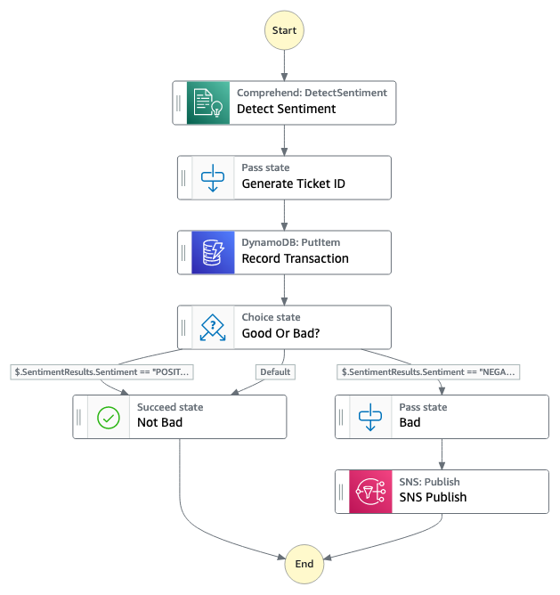

# Contact form processing with Synchronous Express Workflows

This application uses a Synchronous Express workflow to analyse a contact form submission and provide customers with a case reference number.

The following example uses [Amazon API Gateway](https://aws.amazon.com/api-gateway/) HTTP APIs to start an Express Workflow synchronously. The workflow analyses web form submissions for negative sentiment. It generates a case reference number and saves the data in an [Amazon DynamoDB](https://aws.amazon.com/dynamodb/) table. The workflow returns the case reference number and message sentiment score.

For more Step Functions workflows check [ServerlessLand Workflows](https://serverlessland.com/workflows)

**Important:** this application uses various AWS services and there are costs associated with these services after the Free Tier usage - please see the [AWS Pricing page](https://aws.amazon.com/pricing/) for details. You are responsible for any AWS costs incurred. No warranty is implied in this example.

## Requirements

* [Create an AWS account](https://portal.aws.amazon.com/gp/aws/developer/registration/index.html) if you do not already have one and log in. The IAM user that you use must have sufficient permissions to make necessary AWS service calls and manage AWS resources.
* [AWS CLI](https://docs.aws.amazon.com/cli/latest/userguide/install-cliv2.html) installed and configured
* [Git Installed](https://git-scm.com/book/en/v2/Getting-Started-Installing-Git)
* [Terraform](https://learn.hashicorp.com/tutorials/terraform/install-cli?in=terraform/aws-get-started) installed

## How it works



1. A POST request is made to the API which invokes the workflow. It contains the contact form’s message body.
2. The message sentiment is analyzed by [Amazon Comprehend](https://aws.amazon.com/comprehend/).
3. The workflow generates a unique ID to be used as a case reference number, which is recorded in the DynamoDB table. 
4. The workflow choice state branches based on the detected sentiment.
5. If a negative sentiment is detected, a notification is sent to an administrator via [Amazon Simple Notification Service](https://aws.amazon.com/sns/) (SNS).
6. When the workflow completes, it returns a ticketID to API Gateway
7. API Gateway returns the ticketID in the API response.
8. The default region is `us-east-1`, it can also be changed using the variable `region`.

**Note:** Variables can be supplied in different options, check the [Terraform documentation](https://developer.hashicorp.com/terraform/language/values/variables) for more details.

## Deployment Instructions

1. Create a new directory, navigate to that directory in a terminal and clone the GitHub repository:
    ``` 
    git clone https://github.com/aws-samples/step-functions-workflows-collection
    ```
1. Change directory to the pattern directory:
    ```
    cd step-functions-workflows-collection/web-contact-form-processor-tf
    ```
1. From the command line, initialize Terraform to download and install the providers defined in the configuration:
    ```
    terraform init
    ```
1. From the command line, apply the configuration in the main.tf file:
    ```
    terraform apply
    ```
1. During the prompts:
    * Enter an email address that should receive the notifications from the workflow.
    * Enter yes
1. Note the outputs from the deployment process. These contain the resource names and/or ARNs which are used for testing.

## Testing

1. After deployment you receive an email titled `AWS Notification - Subscription Confirmation`. Click on the link in the email to confirm your subscription. This will allow SNS to send you emails.
2. Testing can be done in two ways, by invoking the Step Functions State Machine directly or by making a Post request to the API which invokes the workflow.
3. Testing by directly invoking the Step Functions State Machine:
    1. Go to the AWS [Step Functions Console](https://us-east-1.console.aws.amazon.com/states/home) and find the State Machine from the Terraform Output. It should be named `ProcessFormStateMachineExpressSync-<random_id>`
    2. Select `Start Execution` and use `{"message":" This is bad service"}` or `{"message":" This is good service"}` as a sample input.
    3. Observe the State Machine workflow execution.
    4. Once the workflow completes, if it is a negative sentiment you receive an email notification with the sentiment details and the ticketid.
4. Testing by starting the workflow from HTTP API Gateway:
    1. Trigger the workflow with a POST request, using the API HTTP API endpoint generated from the deploy step. Enter the following CURL command into the terminal: `curl --location --request POST '<YOUR-HTTP-API-ENDPOINT>' --header 'Content-Type: application/json' --data-raw '{"message":" This is bad service"}'` 
    2. The POST request returns a 200 status response. The output field of the response contains the sentiment results and the generated ticketId

## Cleanup
1. Change directory to the pattern directory:
    ```
    cd step-functions-workflows-collection/web-contact-form-processor-tf
    ```
1. Delete all created resources
    ```bash
    terraform destroy
    ```
1. During the prompts:
    * Enter an email address that should receive the notifications from the workflow.
    * Enter yes
1. Confirm all created resources has been deleted
    ```bash
    terraform show
    ```
**Note:** If you destroy an unconfirmed subscription, Terraform will remove the subscription from its state but the subscription will still exist in AWS. For more information check the [Terraform documentation](https://registry.terraform.io/providers/hashicorp/aws/latest/docs/resources/sns_topic_subscription)

----
Copyright 2022 Amazon.com, Inc. or its affiliates. All Rights Reserved.

SPDX-License-Identifier: MIT-0
